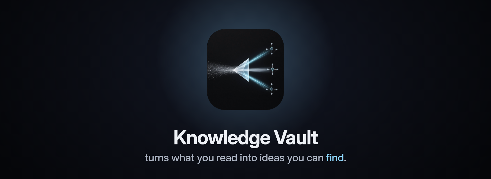

# Knowledge Vault

**A shared memory for your team.** Everything you read — articles, meeting notes, transcripts, docs — goes in. The vault breaks it into small, clear ideas, connects each idea to the ones it relates to, and lets you ask questions in plain language. Every answer comes from your own notes, with the sources cited.

Knowledge Vault is an app for [Powerhouse Connect](https://powerhouse.inc/), built as a Powerhouse package. This repository is that package.

## What it does

- **Turns documents into ideas.** Each note holds one idea, written as a clear sentence. When two sources say the same thing, they add to the same note instead of repeating it in two places.
- **Connects ideas.** Notes are linked to each other, and every link says *why* the two belong together. Topic maps group related notes, so you can browse an area the way you'd browse a table of contents.
- **Answers questions with sources.** Ask the chat anything. It searches the vault, reads the notes that match, and writes an answer with a numbered citation for every note it used — so you can check each claim.
- **Keeps a human in charge.** AI agents can do the heavy lifting — reading sources, writing notes, making links — but a person approves what becomes part of the vault. An author can't approve their own note.
- **Remembers who did what.** Every change is signed and kept, so you can always see who changed a note, when, and what it said before.


## A quick tour

When you open a vault you land on **Chat**. The other views sit alongside it:


| View                                               | What you do there                                                                  |
| -------------------------------------------------- | ---------------------------------------------------------------------------------- |
| **Chat**                                           | Ask a question, get an answer with citations                                       |
| **Search**                                         | Find notes by meaning, not just by exact words                                     |
| **Notes**                                          | Browse every note with its status and topics                                       |
| **Graph**                                          | See how all the ideas connect                                                      |
| **Sources**                                        | The original material the notes came from                                          |
| **Projects** / **Scope**                           | Plans and deliverables, linked to the knowledge behind them                        |
| **Activity**, **Health**, **Pipeline**, **Access** | Who changed what, how healthy the vault is, what's being processed, who can see it |


## How knowledge gets in

1. **Add a source** — paste an article, upload a transcript, or import a document.
2. **Queue it for processing** — one click.
3. **An agent extracts the ideas** — each one becomes its own note, linked to the source it came from.
4. **The ideas get connected** — to each other and into topic maps.
5. **A person reviews and approves** — approved notes become part of the vault.
6. **Health checks run** — the vault reports anything that needs attention.

You can do all of this by hand in the app. The agent side runs through the [powerhouse-knowledge](https://github.com/liberuum/powerhouse-knowledge) plugin for Claude Code, which knows how to seed sources, extract notes, link them and verify the result.

## Choose where the AI runs

The chat reads your vault with a set of read-only tools. You pick the model; the setting stays in your browser:

- **OpenRouter** — hosted models, including free ones. Sign in or paste a key.
- **Your own server** — Ollama, LM Studio, vLLM, llama.cpp, or any OpenAI-compatible endpoint.
- **Connect's AI settings** — reuse the assistant you've already set up in Connect.

The chat can only read. It has no way to run code or change your vault.

## Run it yourself

### Add it to your own Powerhouse setup

First install the Powerhouse CLI, which gives you the `ph` command:

```bash
bun install -g ph-cmd @powerhousedao/ph-cli
```

The package is published to the Powerhouse registry at [registry.vetra.io](https://registry.vetra.io) as `@powerhousedao/knowledge-note`. From your Powerhouse project:

```bash
ph install @powerhousedao/knowledge-note --registry https://registry.vetra.io
```

This registers the package in `powerhouse.config.json`, and Connect loads it from the registry at runtime. Add `--local` to also install it into `node_modules` and bundle it into your Connect build.

The `[Dockerfile](Dockerfile)` and `[docker/](docker/)` show how a Switchboard and Connect are built with it. A deployment sets these five variables (see `[powerhouse.manifest.json](powerhouse.manifest.json)`):


| Variable                       | What it does                                            |
| ------------------------------ | ------------------------------------------------------- |
| `AUTH_ENABLED`                 | Sign people in with Renown and check who they are       |
| `ADMINS`                       | Addresses that can do everything (list at least two)    |
| `DOCUMENT_PERMISSIONS_ENABLED` | Turn on per-document read / write / admin access        |
| `DEFAULT_PROTECTION`           | New documents are private until someone is given access |
| `REQUIRE_AUTHENTICATED_CALLER` | Refuse anonymous requests entirely                      |


### Develop locally

You need [Bun](https://bun.sh) and the Powerhouse CLI (`ph`, installed as shown [above](#add-it-to-your-own-powerhouse-setup)).

```bash
bun install
ph vetra --watch        # local Connect + Switchboard with live code generation
```

Connect opens at `http://localhost:3000` (or `:3001` if 3000 is taken) and the Switchboard at `http://localhost:4001/graphql`.

Before you commit:

```bash
bun run tsc             # type check
bun run lint:fix        # lint
bun run test:coverage   # tests — document model reducers stay at 95%+ coverage
```

> Changes under `subgraphs/` are served from the built output, so run `bun run build` and restart `ph vetra` to see them. See [CLAUDE.md](CLAUDE.md) for the full contributor rules.


## What's in this repository


| Folder                                 | What's inside                                                                                                                |
| -------------------------------------- | ---------------------------------------------------------------------------------------------------------------------------- |
| `[document-models/](document-models/)` | The data: notes, topic maps, sources, tensions, health reports and more — each with its schema and the rules for changing it |
| `[editors/](editors/)`                 | The user interface — the Knowledge Vault app and an editor for each document type                                            |
| `[processors/](processors/)`           | The graph indexer, which keeps a searchable copy of the vault up to date (including meaning-based search)                    |
| `[subgraphs/](subgraphs/)`             | The APIs: a GraphQL API for querying the graph, and a REST API that agents write through                                     |
| `[scripts/](scripts/)`                 | Import, sync and maintenance tools                                                                                           |
| `[tests/](tests/)`                     | Unit, processor and integration tests                                                                                        |
| `[docs/](docs/)`                       | Architecture, the HTTP API reference, plans and migration notes                                                              |


## Learn more

- **[docs/ARCHITECTURE.md](docs/ARCHITECTURE.md)** — every document model, the indexer, the GraphQL queries, the chat's tools, and how they fit together.
- **[docs/http-api.md](docs/http-api.md)** — the REST API: every route, request and response.
- **[powerhouse-knowledge](https://github.com/liberuum/powerhouse-knowledge)** — the Claude Code plugin agents use to work with a vault.

Knowledge Vault is a Powerhouse port of **Ars Contexta**, a personal knowledge method built on markdown files and wiki links, rebuilt here as shared, signed documents that a whole team can work in.

## License

[AGPL-3.0-only](LICENSE)